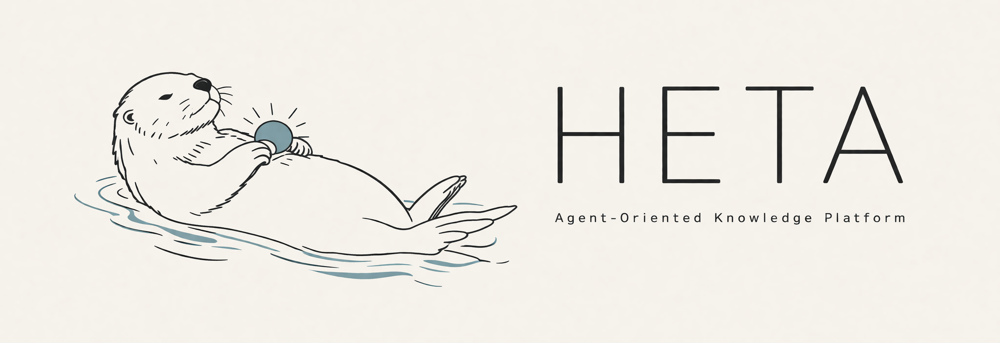

  

  <b>面向智能体的知识管理平台</b> 
  多数据库集成调度 · 双模式记忆 · 结构化知识生成

  
  
  

---

## Heta 是什么？

Heta 是一款面向 AI 智能体的一体化知识基础设施，通过整合多种底层数据库，赋能智能体实现三大核心能力：外部知识获取、自身记忆积累，以及基于知识的推理与生成。

- **HetaDB** — 统一协调多类型数据库，达成外部知识智能接入，无需顾虑数据来源格式及存储库选型。
- **HetaWiki** — 将上传文档编译为可版本化的 Markdown Wiki，支持用户与智能体直接浏览、融合与查询。
- **HetaMem** — 双模式记忆：集成 MemoryVG 以支持基于向量检索的快速情景回溯，并构建随智能体演进的长期知识图谱（MemoryKB）。
- **HetaGen** — 基于已有知识库进行归纳与扩展，生成更具价值的结构化内容。

---

## 核心功能

**HetaDB**

- 基于 MinerU 等工具实现多格式文件解析（涵盖 PDF、HTML、图片、表格、Markdown、Office 系列文档及压缩包等）
- 解析知识自动路由至适配数据库，实现统一管控，无需人工干预存储策略
- 提供多维查询策略以适配差异化场景：`naive`（向量检索）、 `rerank`（BM25 + 向量 + 交叉编码器）、 `rewriter`（查询优化）、`multihop`（多跳推理）、 `direct`（直接查询）
- 支持源文档溯源，确保检索生成回答准确可靠

**HetaWiki**

- 将上传源文档编译为可版本化的 Markdown Wiki 页面
- 提供两种摄入模式：快速新增的 `default ingest` 与精确融合的 agentic `merge ingest`
- 通过 index、page、graph 等接口直接暴露 Wiki 内容，适用于 UI 与智能体读取
- 以独立 git 历史管理 Wiki 内容演化与回滚

**HetaMem**

- **MemoryVG** — 面向高频、碎片化信息的轻量记忆机制，可快速存储与检索对话内容、用户偏好、上下文事实等；具备完整的增删改查能力，并提供详细的历史变更审计日志
- **MemoryKB** — 通过分层知识图谱与参数化回忆相结合，为 AI 智能体提供持续的多模态记忆，使其具备长期上下文理解、动态适应及个性化交互能力。

**HetaGen** _(早期阶段)_

- 基于知识库生成结构化表格数据，并支持对生成表格执行 Text-to-SQL 查询
- 从给定主题出发，自动构建层次化的知识结构体系（结构树）

!!! tip "MCP 集成"
HetaDB 和 HetaMem 提供可选的 MCP 服务器（端口 8012 / 8011），可直接集成 Claude Desktop、Cursor 等 MCP 兼容客户端。

---

## 快速入口

- [Docker 自动部署](quick-start/docker.md) — 推荐，优先拉取发布镜像，失败自动本地构建
- [手动安装](quick-start/manual.md) — 在本地 Python 环境中运行 `heta serve`
- [连接 MCP 客户端](quick-start/mcp-clients.md) — Claude Desktop、Cursor
- [HetaWiki 概览](hetawiki/index.zh.md)
- [REST API 参考](reference/api.md)
